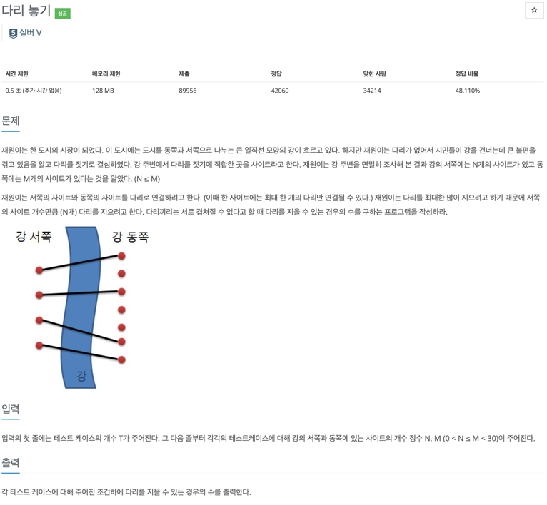
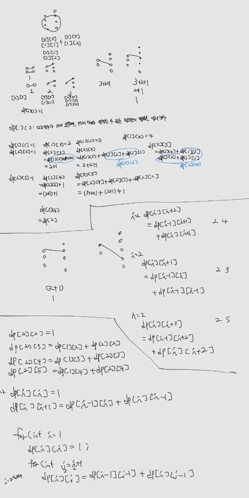

### [baekjoon-1010] 다리 놓기

실버 5였지만, 나에게는 너무나 어려웠던 문제였다. 
이전 문제(피보나치 2, 5)를 풀면서 DP는 왜 빠를까를 곰곰이 고민해보았다. 
이는 곧 최적해를 다시 계산하지 않고, 메모리에 저장해두기 때문이라고 판단했다. 
이를 적용하기 위한 방식 중 하나를 '점화식'이라고 생각한다.

이번 문제에서 핵심은 아래와 같았고, 이를 통해 문제를 해결할 수 있는 실마리를 얻을 수 있었다.
* 점화식을 확실히 정의할 수 있어야한다.
  * 이 문제에서는 다리 갯수가 N개 있을 때, M개의 다리와 연결할 수 있는 최소한의 필요한 다리 갯수라고 정의했다.
* 최대한 일반화를 시켜야한다.
  * 나는 이 문제에서 [2][3], [2][4] [2][5] ... 하나의 for문 내 여러개의 점화식이 필요한 줄 알았다.
  * 하지만, [2][j] 간의 최대한 일반화시켜 연관관계를 맺음으로써 점화식을 정의하는데에 도움이 되었다.
* 꼭 필요한 시점에 최적의 해를 구해놓을 필요는 없다.
  * 이 문제에서는 입력 받기 전, 모든 최적해를 ``미리`` 구해놓음으로써 해결할 수 있었다.

