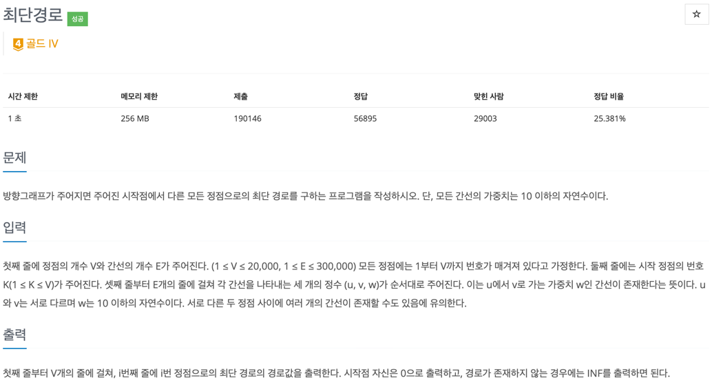

### [baekjoon-1753] 최단 거리

### First
1. 인접 리스트 
인접 행렬로 그래프를 구현 시에는 O(V^2) 즉 20,000^2 = O(200,000,000)로 인한 시간초과 발생 
인접 리스트로 구현함으로써 O(V+E) 즉, 20,000 + 300,000 = O(320,000)를 통해 시간초과가 발생하지 않음

2. 목표치 노드의 dp 값 갱신 + 여러번의 호출 
dp[N]: 시작지점부터 특정 노드 N 까지의 최소 거리 
탐색 조건: 다음 탐색 노드와 목표치 노드가 같지 않은 경우 
갱신 조건: 목표치 노드의 dp보다 현재까지 도달한 가중치 값이 작은 경우
dp를 갱신 시켜주기 위해서 목표치 노드를 정하고, 한 차례씩 bfs를 순회해서(for문) 탐색하도록 했다.
하지만, 이 방법은 다음 탐색할 노드가 목표치 노드와 같지 않으면 무조건 Queue에 노드를 삽입시킨다. 또한, 이러한 bfs를 여러번 호출하기 때문에 메모리 초과가 발생했다.
 
e.g 인접리스트 1  19999 19998... 3 2 인 (최악)경우 메모리 초과 발생

### Second
1. 다음 탐색할 노드보다 한번의 bfs 호출 
탐색 조건&갱신 조건: 다음 탐색할 노드의 dp보다 현재까지 도달한 가중치 값이 작은 경우 
한 번의 bfs 호출로 모든 dp를 갱신시키기 위해서 탐색 조건과 갱신조건을 같도록 두었다.  

### Main
1. 우선순위 큐 
우선순위 큐를 가중치가 낮은 노드부터 먼저 탐색하는 것을 보장하고, dp를 최소화된 값으로 고정시켜줌으로써
무분별한 queue에 노드가 들어가지 않도록 구현했다
 
e.g 인접리스트 1  19999(300000) 19998(299999) 19995(2) 인 (최악)경우 시간 초과 발생

### 정리
1. 메모리 초과가 발생한다 
=> 큐에 데이터가 무분별하게 들어가진 않는지 확인한다. 
=> bfs가 여러번 호출될 필요가 있는지 확인한다.

2. 시간 초과가 발생한다 
=> 특정 자료구조(우선순위 큐)를 통해 해결할 수는 없는지 확인한다.