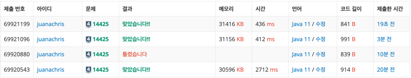

### [baekjoon-14425] 문자열 집합

첫번째 풀이
이중 루프 + 문자열 간 equals로 접근하면 간단하게 풀렸다.

두번째 풀이
주어진 문제의 시간 제한은 2초이지만, 1초 일 때는 첫번째 풀이로는 풀 수 없다.
따라서, Java Collection의 HashSet의 시간복잡도가 O(1)인 add 또는 contains를 사용했다.

(가장 아래부터, 틀렸습니다 제외)
 
첫번째 풀이
 
두번째 풀이 - HashSet의 add
 
세번째 풀이 - HashSet의 contains