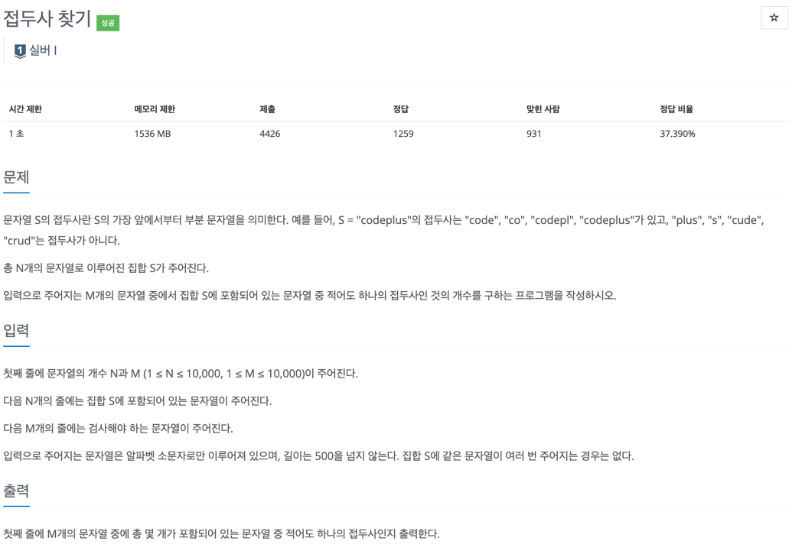

### [baekjoon-14426] 접두사 찾기

보다 효율적인 알고리즘

- 첫번째 시도. 3중 반복문으로 순회
  - O(10000 * 10000 * 10000): 시간 초과가 발생하였다.
- 두번째 시도. startsWith + ArrayList
  - ArrayList는 조회 시 내부적으로 배열이 쓰이고 있으며,
  - 이에 startsWith를 활용해보았지만 타이트한 풀이 선택으로 시간초과 발생가 발생하였다.
    - O(10000 * 10000): 1초
- 세번째 시도. 트라이 자료구조 사용
  - 각 노드 별 문자만을 저장해, 찾고자 하는 문자열 탐색 시에 효율적인 트라이 자료구조를 선택하였다.
    - O(10000): 0.0001초