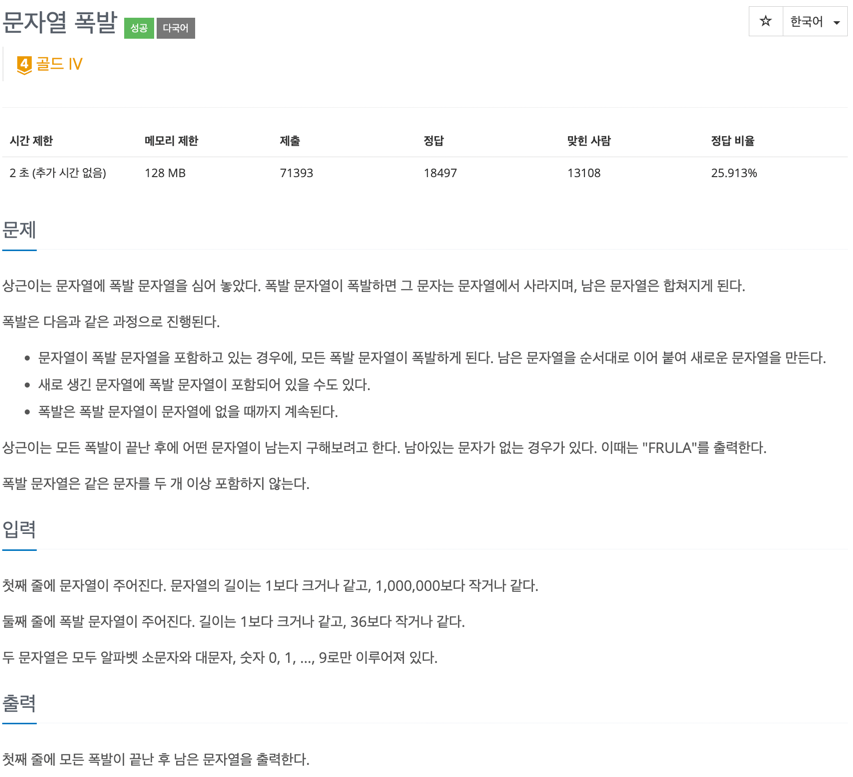

### [baekjoon-9935] 문자열 폭발



문제를 보면, 문자열을 replaceAll로 없애주면 된다고 생각해 아래처럼 단순하게 접근했다.
```java
while(input.contains(target)) {
    input = input.replaceAll(target, "");
}
```

하지만, 메모리 초과로 인한 실패가 발생했다.
왜냐하면, java String은 Immutable하게 설계 되었기 때문에, 
서로 다른 값을 지닌 객체에 대해 새로운 공간을 할당한다. 이로 인해 OOM이 발생하는 것이다.
<br>

다음으로, StringBuilder를 쓰는 것을 생각해볼 수 있겠지만, 
replaceAll의 결과는 결국 어딘가에 저장해야하고, 이를 기반으로 다시
로직을 동작시켜야 하기 때문에 무의미하다고 판단했다.

<br>
replaceAll을 어딘가에 저장시키기 위해 stack또는 queue가 생각났다.
이 문제에서는 단순히 문자열을 제거하는 게 아니라, 다시 합쳐지는 것까지 고려해야 하기 때문에
이에 적합한 자료구조는 stack이라고 판단했다. 까다로웠던 점은 스택과 target 간 비교였는데,
왜냐하면 스택에 input을 넣을때마다 target과 비교하기 위해서는 둘 중 하나는 인덱스로 곧바로 접근해야 시간초과 및 메모리 초과가 발생하지 않기 때문이다.
문자열을 다룰 때 String 객체만을 사용해서 풀어야한다는 사고를 깨뜨려준 문제였다.


