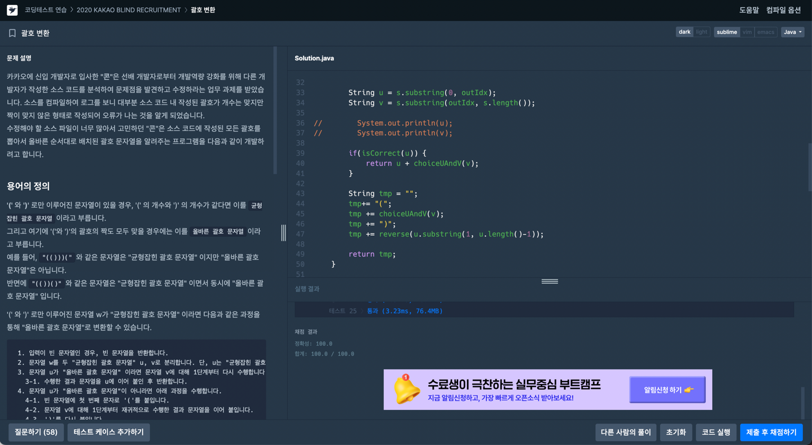

[programmers-level2] 괄호 변환

문제에 나와있는 설명대로 구현하는 문제였다. 아래처럼 도식화를 진행해서 해결했다.   
* 균형잡인 괄호 문자열로 분리
  * u와 v를 지정
    * u가 올바른 괄호 문자열일 경우
      * v에 대해 분리 재귀
    * u가 올바른 괄호 문자열이 아닐 경우
      * 괄호
      * v에 대해 분리 재귀
      * 뒤집기
